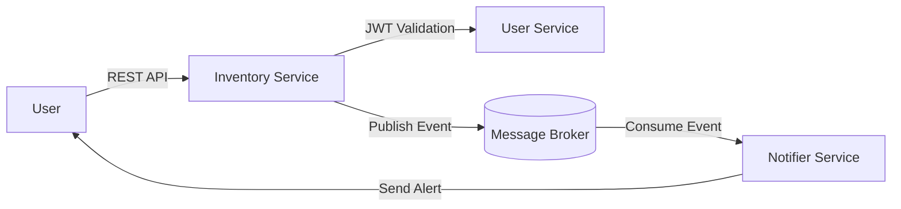

# 🧾 ShelfLife Monitor – System Architecture (v1)

## 1. Overview
**ShelfLife Monitor** is a microservices-based web application that helps users track the expiry dates of inventory items.  
The system allows users to manage their items, automatically detect upcoming expirations, and receive timely notifications through multiple channels.

---

## 2. Services Overview

### 🧱 2.1 Inventory Service
**Purpose:**  
Manages all CRUD operations for inventory items. Validates each request using user authentication provided by the User Service.

**Key Responsibilities:**
- Create, update, retrieve, and delete item records.  
- Validate user identity through the User Service before processing requests.  
- Determine when items are approaching their expiry date.  
- Publish events (e.g., `item.created`, `item.updated`, `item.expiry.near`) to the message broker.

**Owns Data:**  
Inventory database containing item details such as:
- `item_id`, `name`, `category`, `quantity`, `expiry_date`, `owner_id`

**Publishes Events:**  
- `item.created`  
- `item.updated`  
- `item.deleted`  
- `item.expiry.near`

---

### 👤 2.2 User Service
**Purpose:**  
Handles user registration, authentication, and management. Acts as the system’s identity provider.

**Key Responsibilities:**
- Register and authenticate users.  
- Issue and validate authentication tokens for secure communication.  
- Store user profile and credential data.  
- Expose APIs for other services (Inventory and Notifier) to validate user information.

**Owns Data:**  
User database with:
- `user_id`, `username`, `email`, `password_hash`, `role`, `created_at`

**Authentication Mechanism:**  
OAuth 2.0 with password hashing (e.g., bcrypt or Argon2) and JWT tokens for session management.

---

### 🔔 2.3 Notifier Service
**Purpose:**  
Listens for events from the Inventory Service and triggers user notifications when items are nearing expiry.

**Key Responsibilities:**
- Subscribe to expiry-related events (`item.expiry.near`).  
- Send alerts via multiple channels (email, SMS, dashboard).  
- Maintain logs of sent notifications and avoid duplicates.  
- Periodically check items to ensure no missed notifications.

**Owns Data:**  
Notifications database containing:
- `notification_id`, `user_id`, `item_id`, `message`, `status`, `timestamp`

**Notification Channels:**  
- Email  
- SMS  
- Web (in-app dashboard)

**Scheduling Interval:**  
Every 10 minutes (configurable via environment variable).

---

## 3. Data Ownership
Each microservice maintains its own database and schema to ensure loose coupling and independent scalability.

| Service | Database | Description |
|:--|:--|:--|
| **User Service** | `users_db` | Stores user credentials and profiles |
| **Inventory Service** | `inventory_db` | Stores item metadata and expiry details |
| **Notifier Service** | `notifier_db` | Stores notification logs and delivery history |

This separation allows each service to evolve independently and prevents cross-service schema dependencies.

---

## 4. Communication Patterns

### Service Interactions
- **User ↔ Inventory:**  
  Communication via REST APIs.  
  - Inventory calls the User Service to validate or authorize requests using JWT tokens.  

- **Inventory → Notifier:**  
  Communication via asynchronous **message broker** (e.g., RabbitMQ, Redis Streams, or Kafka).  
  - Inventory publishes expiry-related events.  
  - Notifier consumes those events and triggers notifications.

### Example Flow
```text
User → Inventory API → publishes event → Message Queue → Notifier consumes event → sends alert
```

