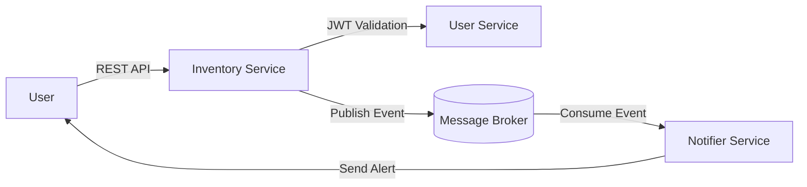

# 🧾 ShelfLife Monitor – System Architecture (v1)

## 1. Overview
**ShelfLife Monitor** is a microservices-based web application that helps users track the expiry dates of inventory items.  
The system allows users to manage their items, automatically detect upcoming expirations, and receive timely notifications through multiple channels.

---

## 2. Services Overview

### 🧱 2.1 Inventory Service
**Purpose:**  
Manages all CRUD operations for inventory items. Validates each request using user authentication provided by the User Service.

**Key Responsibilities:**
- Create, update, retrieve, and delete item records.  
- Validate user identity through the User Service before processing requests.  
- Determine when items are approaching their expiry date.  
- Publish events (e.g., `item.created`, `item.updated`, `item.expiry.near`) to the message broker.

**Owns Data:**  
Inventory database containing item details such as:
- `item_id`, `name`, `category`, `quantity`, `expiry_date`, `owner_id`

**Publishes Events:**  
- `item.created`  
- `item.updated`  
- `item.deleted`  
- `item.expiry.near`

---

### 👤 2.2 User Service
**Purpose:**  
Handles user registration, authentication, and management. Acts as the system’s identity provider.

**Key Responsibilities:**
- Register and authenticate users.  
- Issue and validate authentication tokens for secure communication.  
- Store user profile and credential data.  
- Expose APIs for other services (Inventory and Notifier) to validate user information.

**Owns Data:**  
User database with:
- `user_id`, `username`, `email`, `password_hash`, `role`, `created_at`

**Authentication Mechanism:**  
OAuth 2.0 with password hashing (e.g., bcrypt or Argon2) and JWT tokens for session management.

---

### 🔔 2.3 Notifier Service
**Purpose:**  
Listens for events from the Inventory Service and triggers user notifications when items are nearing expiry.

**Key Responsibilities:**
- Subscribe to expiry-related events (`item.expiry.near`).  
- Send alerts via multiple channels (email, SMS, dashboard).  
- Maintain logs of sent notifications and avoid duplicates.  
- Periodically check items to ensure no missed notifications.

**Owns Data:**  
Notifications database containing:
- `notification_id`, `user_id`, `item_id`, `message`, `status`, `timestamp`

**Notification Channels:**  
- Email  
- SMS  
- Web (in-app dashboard)

**Scheduling Interval:**  
Every 10 minutes (configurable via environment variable).

---

## 3. Data Ownership
Each microservice maintains its own database and schema to ensure loose coupling and independent scalability.

| Service | Database | Description |
|:--|:--|:--|
| **User Service** | `users_db` | Stores user credentials and profiles |
| **Inventory Service** | `inventory_db` | Stores item metadata and expiry details |
| **Notifier Service** | `notifier_db` | Stores notification logs and delivery history |

This separation allows each service to evolve independently and prevents cross-service schema dependencies.

---

## 4. Communication Patterns

### Service Interactions
- **User ↔ Inventory:**  
  Communication via REST APIs.  
  - Inventory calls the User Service to validate or authorize requests using JWT tokens.  

- **Inventory → Notifier:**  
  Communication via asynchronous **message broker** (e.g., RabbitMQ, Redis Streams, or Kafka).  
  - Inventory publishes expiry-related events.  
  - Notifier consumes those events and triggers notifications.

### Example Flow
```text
User → Inventory API → publishes event → Message Queue → Notifier consumes event → sends alert
```

## 7. Inter-Service Communication Plan

### Communication Types

- **User Service → Inventory Service:**  
  REST-based communication for all user-initiated item operations (CRUD).

- **Inventory Service → User Service:**  
  REST API calls to validate user identity and permissions using JWT tokens before processing item requests.

- **Inventory Service → Notifier Service:**  
  Asynchronous, event-driven communication via a message broker (e.g., RabbitMQ or Redis Streams).  
  Inventory publishes events when relevant changes occur; Notifier subscribes and processes them independently.

---

### Example Event Types
| Event Name | Producer | Consumer | Description |
|:--|:--|:--|:--|
| `item.created` | Inventory Service | Notifier Service | Triggered when a new item is added to inventory |
| `item.deleted` | Inventory Service | Notifier Service | Triggered when an item is removed |
| `item.expiry.near` | Inventory Service | Notifier Service | Triggered when an item’s expiry date is approaching |

---

### Reliability & Delivery
- Each event is published asynchronously and stored in the message queue until acknowledged by the Notifier Service.  
- Notifier implements **idempotency** to avoid duplicate notifications.  
- Temporary network or broker failures are handled through **retries and exponential backoff**.  
- REST interactions include appropriate **HTTP status codes** and **timeout handling** for reliability.

## 8. Database & Data Model Design

Each microservice in ShelfLife Monitor maintains its **own database and schema**.  
This ensures loose coupling, independent scalability, and fault isolation.  
No direct foreign key relationships exist between services; instead, they communicate via APIs or events.

---

### 👤 8.1 User Service Database

**Database:** `users_db`  
**Type:** Relational (PostgreSQL or SQLite)  
**Purpose:** Stores user authentication and profile data.

| Field | Type | Description |
|:--|:--|:--|
| `user_id` | UUID (Primary Key) | Unique user identifier |
| `username` | String | User’s login name |
| `email` | String | User’s contact email |
| `password_hash` | String | Hashed password for authentication |
| `role` | Enum (user, admin) | Defines access level |
| `created_at` | Timestamp | Account creation date |

**Consistency:**  
- User Service is the source of truth for identity and permissions.  
- Other services validate user data through REST API calls (using JWT tokens).

---

### 📦 8.2 Inventory Service Database

**Database:** `inventory_db`  
**Type:** Relational (PostgreSQL or SQLite)  
**Purpose:** Manages inventory items and their expiry details.

| Field | Type | Description |
|:--|:--|:--|
| `item_id` | UUID (Primary Key) | Unique item identifier |
| `name` | String | Item name |
| `category` | String | Item type/category |
| `quantity` | Integer | Quantity in stock |
| `expiry_date` | Date | When the item expires |
| `owner_id` | UUID (Reference to User) | User who owns the item |
| `created_at` | Timestamp | Item creation time |
| `updated_at` | Timestamp | Last updated time |

**Consistency:**  
- Ownership verified by calling User Service for authentication.  
- Publishes events like `item.created`, `item.deleted`, and `item.expiry.near` to the message broker.  
- Operates independently even if other services are temporarily unavailable.

---

### 🔔 8.3 Notifier Service Database

**Database:** `notifier_db`  
**Type:** Relational (PostgreSQL) or In-Memory (Redis)  
**Purpose:** Tracks notifications, delivery status, and retry attempts.

| Field | Type | Description |
|:--|:--|:--|
| `notification_id` | UUID (Primary Key) | Unique notification record |
| `user_id` | UUID | Recipient user |
| `item_id` | UUID | Related inventory item |
| `message` | String | Notification text |
| `status` | Enum (pending, sent, failed) | Current delivery state |
| `created_at` | Timestamp | Notification creation time |
| `sent_at` | Timestamp | When message was delivered |
| `retry_count` | Integer | Number of retry attempts |

**Consistency:**  
- Consumes events from the message broker (e.g., `item.expiry.near`).  
- Ensures **idempotent** processing to prevent duplicate alerts.  
- Uses **retries with exponential backoff** for failed deliveries.

---

### 🔗 8.4 Logical Relationships (Non-Relational)

Although the databases are isolated, the system maintains logical references:

## 9. Event Flow & Notification Logic

### 🔄 Core Event Sequence

1. **Item Created → Expiry Check → Notification**
   - User creates an item via the Inventory Service.
   - A scheduler (cron job or background worker) runs every **24 hours** in the Inventory Service.
   - It scans items for those expiring within the configured threshold (e.g., 3 days).
   - When such items are found, the service emits an `item.expiry.near` event.
   - The Notifier Service receives the event, sends a notification, waits for acknowledgment, and updates the delivery status in its database.
   - If delivery fails, the Notifier retries with exponential backoff.

2. **Item Updated → Revalidation**
   - When an item is updated (e.g., expiry date changed), the Inventory Service detects the change.
   - If any expiry-related notifications already exist, it emits an `item.updated` event.
   - The Notifier Service listens for this and updates or cancels previous notifications accordingly.

3. **Acknowledgment Handling**
   - After sending a notification (email, SMS, or dashboard alert), the Notifier waits for acknowledgment (from the delivery system or user).
   - On success, it marks the notification as **sent**.
   - On failure, it retries up to a configured limit before marking as **failed**.

---

### 📈 Event Flow Diagram

```mermaid
sequenceDiagram
    participant Inventory as Inventory Service
    participant Scheduler as Daily Scheduler
    participant Notifier as Notifier Service

    Inventory->>Scheduler: Item Created
    Scheduler->>Inventory: Run expiry check (every 24 hrs)
    Inventory->>Notifier: Emit "item.expiry.near" event
    Notifier->>Notifier: Send notification & wait for acknowledgment
    Notifier-->>Notifier: Update status (sent / failed / retry)

    Inventory->>Notifier: Emit "item.updated" event
    Notifier->>Notifier: Update or cancel previous notification

## 11. Authentication & Security Design
```mermaid
sequenceDiagram
    participant User
    participant UserService as User Service
    participant InventoryService as Inventory Service

    User->>UserService: POST /login (email, password)
    UserService-->>User: JWT Token
    User->>InventoryService: Request with Authorization: Bearer <token>
    InventoryService->>UserService: Validate Token (optional)
    UserService-->>InventoryService: Valid / Invalid
    InventoryService-->>User: Response (authorized / unauthorized)
```


